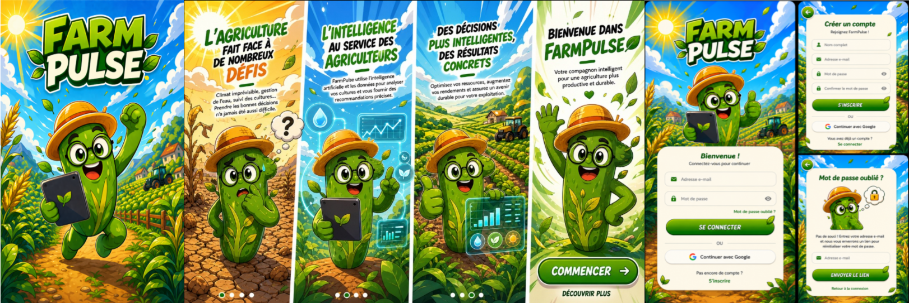

  

<h1 align="center"> FarmPulse – Smart Agriculture App</h1>

Smart Agriculture Platform powered by <b>Artificial Intelligence (AI)</b> and <b>Business Intelligence (BI)</b>.

---

##  Demo

Watch the application demo:

https://github.com/syrinehamdouni/FarmPulse-Smart-Agriculture-App/clideo_editor_aecbd1df0c0b4c03a87a69d8cd6d2ef6.mp4

---

# FarmPulse – Smart Agriculture App

**FarmPulse** is a cutting-edge smart agriculture application designed for Tunisian farmers. It combines **Artificial Intelligence (AI)** and **Business Intelligence (BI)** to help farmers monitor crops, optimize resources, and increase productivity sustainably.

---

# Table of Contents

1. [Project Overview](#project-overview)
2. [Key Features](#key-features)
3. [AI & ML Integration](#ai--ml-integration)
4. [Business Intelligence (BI)](#business-intelligence-bi)
5. [User Interface](#user-interface)
6. [Technology Stack](#technology-stack)
7. [Installation & Setup](#installation--setup)
8. [Dataset](#dataset)
9. [License](#license)

---

#  Project Overview

FarmPulse is a smart agriculture platform that provides real-time monitoring, predictive analytics, and actionable insights to farmers.

It empowers them to:

-  Detect diseases and pests early
-  Optimize irrigation and fertilizer usage
-  Track crop growth and productivity
-  Reduce losses and improve sustainability

---

#  Key Features

-  **Interactive Dashboard**
  - Daily crop monitoring
  - Resource usage
  - Disease alerts
  - Productivity metrics

-  **AI-Powered Disease Detection**
  - Plant classification (Healthy / Diseased)
  - Smart recommendations

-  **Farmer & Field Segmentation**
  - Unsupervised ML clustering
  - Performance analysis

- **Business Intelligence Reports**
  - Interactive charts
  - KPIs
  - PDF reports

-  **Cross-Platform Mobile App**
  - Flutter (Android & iOS)

-  **Real-Time Notifications**
  - Irrigation alerts
  - Disease risk
  - Crop management reminders

---

#  AI & ML Integration

### Supervised Learning

- Disease detection from crop images
- Crop yield prediction using:
  - Weather
  - Soil conditions
  - Historical production

### Unsupervised Learning

- Farmer segmentation
- Crop behavior analysis
- Productivity anomaly detection

### Integration

All AI insights are synchronized with the BI dashboard to provide actionable recommendations.

---

#  Business Intelligence (BI)

-  Descriptive Analytics
-  Predictive Analytics
-  Diagnostic Analytics
- Decision Support

Farmers receive real-time recommendations for:

- Irrigation
- Fertilization
- Harvesting

---

#  User Interface

- Dashboard
- Operations Tracking
- Disease Detection
- Analytics & Reports
- Farmer Segmentation
- Sustainability Management
- Settings & Help

---

# 🛠 Technology Stack

| Layer | Technologies |
|--------|--------------|
| Frontend | Flutter |
| Backend | Python + FastAPI |
| Database | PostgreSQL |
| AI/ML | TensorFlow, PyTorch, Scikit-learn |
| BI | Flutter Charts, Metabase, Apache Superset |

---

#  Dataset

###  PlantVillage — Disease Detection

Plant Disease Dataset (Image Classification)

https://www.innovatiana.com/en/datasets/plantvillage?utm_source=chatgpt.com

### FarmPulse Dataset

https://drive.google.com/file/d/1of-Kg5QrXlY16CPM_o1sXoPmZg-lLI9P/view?usp=sharing

---

#  Application Preview

  

---

#  License

MIT License © 2026 FarmPulse Team
